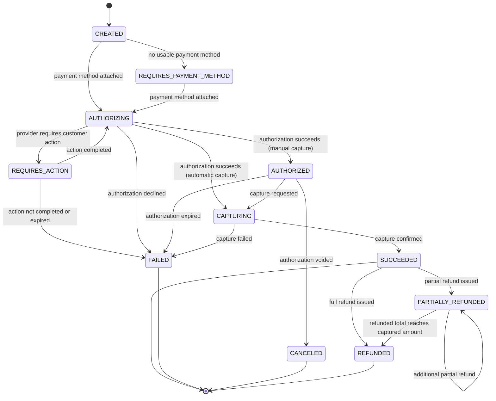

# FraterUnion Payments — Payment Lifecycle

## Status

Authoritative. Defines the provider-neutral payment state machine and the
rules governing how payment state is created and changed. Provider
adapters (Stripe first) must translate provider-specific statuses into
this model; no provider-specific status may be exposed outside the
adapter layer. The canonical state machine is implemented in
`@fraterunion-payments/payment-core`. Persistence and the public
create/get/list API are implemented; see
[`payments-persistence.md`](./payments-persistence.md). Provider calls
and public lifecycle mutation endpoints are not implemented yet.

Last updated: 2026-09-02

The provider-neutral domain implementation lives in
`@fraterunion-payments/payment-core`. See
[`payment-domain.md`](./payment-domain.md).

## States and definitions

The v1 normalized states are used as specified, without modification:

| State                     | Definition                                                                                                                                                                                    |
| ------------------------- | --------------------------------------------------------------------------------------------------------------------------------------------------------------------------------------------- |
| `CREATED`                 | A payment record exists internally but has not yet been submitted to the provider for authorization.                                                                                          |
| `REQUIRES_PAYMENT_METHOD` | The payment has no usable payment method attached yet and cannot proceed until one is provided.                                                                                               |
| `REQUIRES_ACTION`         | The provider requires additional customer action (for example, 3D Secure authentication) before authorization can proceed.                                                                    |
| `AUTHORIZING`             | A request to authorize the payment has been sent to the provider and a definitive result has not yet been recorded internally.                                                                |
| `AUTHORIZED`              | The provider has authorized the payment (funds reserved) but capture has not yet occurred. Only reachable in the manual-capture flow.                                                         |
| `CAPTURING`               | A request to capture previously authorized funds, or to capture immediately as part of an automatic-capture flow, has been sent and a definitive result has not yet been recorded internally. |
| `SUCCEEDED`               | The payment has been captured successfully; funds have been (or will be, per provider settlement timing) collected.                                                                           |
| `FAILED`                  | The payment did not succeed — authorization was declined, capture failed, or a required customer action was not completed in time.                                                            |
| `CANCELED`                | An authorized-but-not-captured payment was voided before capture.                                                                                                                             |
| `PARTIALLY_REFUNDED`      | The payment succeeded and part, but not all, of the captured amount has been refunded.                                                                                                        |
| `REFUNDED`                | The payment succeeded and the full captured amount has been refunded, whether through one refund or the cumulative sum of multiple partial refunds.                                           |

`SUCCEEDED`, `FAILED`, `CANCELED`, and `REFUNDED` are terminal with respect
to the authorization/capture flow. `SUCCEEDED` and `PARTIALLY_REFUNDED` can
still transition due to subsequent refund activity, as shown below.

## Allowed transitions

| From                      | To                        | Trigger                                                                                          |
| ------------------------- | ------------------------- | ------------------------------------------------------------------------------------------------ |
| `CREATED`                 | `REQUIRES_PAYMENT_METHOD` | Payment created without a usable payment method.                                                 |
| `CREATED`                 | `AUTHORIZING`             | Payment created with a usable payment method; authorization requested.                           |
| `REQUIRES_PAYMENT_METHOD` | `AUTHORIZING`             | A payment method is attached and authorization is requested.                                     |
| `AUTHORIZING`             | `REQUIRES_ACTION`         | Provider response indicates additional customer action is required.                              |
| `REQUIRES_ACTION`         | `AUTHORIZING`             | Customer completes the required action; authorization is retried/continued.                      |
| `REQUIRES_ACTION`         | `FAILED`                  | Required action is not completed before expiration.                                              |
| `AUTHORIZING`             | `AUTHORIZED`              | Provider confirms authorization succeeded (manual-capture flow).                                 |
| `AUTHORIZING`             | `CAPTURING`               | Provider confirms authorization succeeded and automatic capture proceeds immediately.            |
| `AUTHORIZING`             | `FAILED`                  | Provider declines authorization.                                                                 |
| `AUTHORIZED`              | `CAPTURING`               | Capture requested for a previously authorized payment.                                           |
| `AUTHORIZED`              | `CANCELED`                | Authorization voided before capture.                                                             |
| `AUTHORIZED`              | `FAILED`                  | Authorization expires before capture is requested.                                               |
| `CAPTURING`               | `SUCCEEDED`               | Provider confirms capture succeeded.                                                             |
| `CAPTURING`               | `FAILED`                  | Provider confirms capture failed.                                                                |
| `SUCCEEDED`               | `PARTIALLY_REFUNDED`      | A refund is issued for less than the captured amount.                                            |
| `SUCCEEDED`               | `REFUNDED`                | A refund is issued for the full captured amount.                                                 |
| `PARTIALLY_REFUNDED`      | `PARTIALLY_REFUNDED`      | An additional partial refund is issued and the refunded total remains below the captured amount. |
| `PARTIALLY_REFUNDED`      | `REFUNDED`                | The cumulative refunded amount reaches the captured amount.                                      |

No other transitions are valid. In particular, a payment can never move
backward from a terminal capture outcome (`FAILED`, `CANCELED`) to an
earlier state; a new payment must be created instead.

## State diagram

## Payment creation flow

1. **Authentication.** The caller (a consumer product) is authenticated via
   API key.
2. **Tenant resolution.** The organization is resolved from the
   authenticated API key — never from a request body field.
3. **Idempotency validation.** The request's idempotency key is checked
   against previously seen keys for that organization; a repeated key
   returns the original result instead of creating a new payment.
4. **Request validation.** Amount, currency, customer reference, and
   payment-method reference are validated.
5. **Internal payment creation.** A payment record is created in state
   `CREATED`, scoped to the organization.
6. **Provider call.** The provider adapter is invoked to authorize (and,
   for automatic capture, capture) the payment.
7. **Provider reference persistence.** The provider's reference for the
   operation (for example, a Payment Intent identifier) is persisted
   against the internal payment record before returning a response.
8. **Initial response.** An initial response is returned to the caller,
   reflecting the state known synchronously (which may be non-terminal,
   such as `REQUIRES_ACTION` or `AUTHORIZING`).
9. **Event-driven finalization.** The payment's terminal outcome is
   determined by verified provider webhook events processed asynchronously
   (see [Source of truth](#source-of-truth)), not by the synchronous
   response alone.
10. **Ledger posting.** Once a payment reaches `SUCCEEDED` (or a refund is
    confirmed), corresponding ledger entries are posted (see
    [`ledger-principles.md`](./ledger-principles.md)).
11. **Outgoing event.** A normalized, signed event is emitted to the
    consumer product reflecting the finalized state change.

## Authorization and capture

- **Automatic capture** authorizes and captures funds in one logical
  operation from the caller's perspective; internally this still passes
  through `AUTHORIZING` → `CAPTURING` → `SUCCEEDED`.
- **Manual capture** separates authorization from capture, allowing a
  payment to sit in `AUTHORIZED` until an explicit capture call is made
  (for example, to confirm order fulfillment first).
- **Authorization expiration** is provider-defined; an `AUTHORIZED`
  payment that is not captured before the provider's authorization window
  closes transitions to `FAILED`.
- **Partial capture** is a domain monetary possibility: a single successful
  capture may record `0 < capturedAmount <= authorizedAmount`. The state
  machine still has one capture completion (`CAPTURING` → `SUCCEEDED`).
  Repeated incremental captures are **not** in the matrix — whether a
  provider can issue multiple capture commands is a future capability
  check, not a core transition. This updates the earlier “full authorized
  amount only” product note so the domain is not forced into all-or-nothing
  arithmetic (see [`payment-domain.md`](./payment-domain.md)).
- **Capture failures** transition the payment to `FAILED` and do not
  automatically retry; a new payment is required if the customer wishes to
  try again, unless a documented retry policy is introduced later.

## Failure handling

The following situations are expected and must be handled explicitly
rather than treated as unrecoverable errors:

- **Provider timeout before response.** The provider call may have
  succeeded even though the client did not receive a response. The
  payment must not be assumed to have failed; its state must be resolved
  through the provider's webhook or a subsequent provider status fetch
  (reconciliation), not by immediately creating a replacement payment.
- **Provider succeeds but the API response is lost.** Same resolution as
  above — the webhook and/or reconciliation are the recovery path.
- **Duplicate client request.** Handled by idempotency keys (see
  [Payment creation flow](#payment-creation-flow), step 3); the original
  result is returned rather than a new payment being created.
- **Duplicate webhook.** Handled by event deduplication (see
  [`security-boundaries.md`](./security-boundaries.md)); a duplicate event
  must not cause a duplicate state transition or ledger entry.
- **Out-of-order webhook.** State transitions are validated against the
  [allowed transitions](#allowed-transitions) table; an event that would
  imply an invalid transition (for example, a "succeeded" event arriving
  after a later "refunded" event was already processed) is recorded but
  does not override the more advanced state.
- **Provider status divergence.** If the provider's reported status and
  the internal normalized state disagree, the discrepancy is surfaced
  through reconciliation (see
  [`ledger-principles.md`](./ledger-principles.md)) rather than silently
  overwritten in either direction.
- **Recovery through provider fetch/reconciliation.** When webhook
  delivery cannot be assumed reliable (for example, after an incident),
  the provider's own API is queried to fetch authoritative status for
  affected payments as a recovery mechanism.

## Refund lifecycle

- **Full refund** returns the entire captured amount and moves the payment
  to `REFUNDED`.
- **Partial refund** returns less than the captured amount and moves the
  payment to `PARTIALLY_REFUNDED`.
- **Multiple partial refunds** are allowed as long as their cumulative
  total does not exceed the captured amount; the last refund that brings
  the cumulative total to the full captured amount moves the payment to
  `REFUNDED`.
- **Maximum refundable amount** for any refund request is the captured
  amount minus the sum of previously succeeded refunds; requests exceeding
  this are rejected before being sent to the provider.
- **Refund pending vs. succeeded** — a refund request is not final at the
  moment it is submitted to the provider; like payments, its true outcome
  is confirmed by a verified provider webhook. Internal payment state
  reflects a refund only once it is confirmed succeeded.
- **Ledger reversal / compensating entries.** A confirmed refund is
  represented with new, compensating ledger entries — it never mutates or
  removes the ledger entries created for the original payment (see
  [`ledger-principles.md`](./ledger-principles.md)).
- **No destructive mutation of original financial history.** Refunding a
  payment never edits or deletes the original payment record's history;
  the payment's full lifecycle (including any failed refund attempts)
  remains inspectable.

## Source of truth

- **The provider is authoritative for provider execution.** Whether a
  charge was actually authorized, captured, or refunded at the payment
  network level is determined by the provider, not by FraterUnion
  Payments' internal assumptions.
- **FraterUnion Payments is authoritative for normalized internal state
  and ledger representation.** Once provider execution is known (via
  webhook or reconciliation), the normalized state and the ledger built
  from it are the system of record that consumer products and internal
  tooling rely on.
- **Reconciliation resolves discrepancies** between what the provider
  reports and what FraterUnion Payments has recorded, surfacing mismatches
  rather than silently resolving them (see
  [`ledger-principles.md`](./ledger-principles.md)).
- **Frontend callbacks are never authoritative for final payment success.**
  A client-side "success" callback (for example, from a provider's
  JavaScript SDK) may inform UI state, but it never, by itself, marks a
  payment `SUCCEEDED` internally or triggers ledger posting; only a
  verified backend signal (webhook, or reconciliation fetch) does.

## Related decisions

- [ADR-004](../decisions/ADR-004-provider-abstraction.md) — why provider
  statuses are translated into the normalized states used above.
- [ADR-006](../decisions/ADR-006-append-only-double-entry-ledger.md) —
  the ledger model that payment success and refunds post to.
- [ADR-007](../decisions/ADR-007-transactional-outbox-and-inbox.md) — the
  delivery guarantees behind webhook-driven finalization.
- [ADR-009](../decisions/ADR-009-integer-minor-units-for-money.md) — the
  representation of payment and refund amounts.
