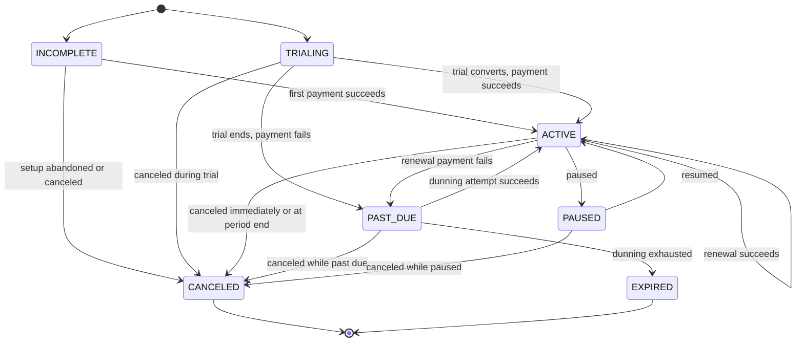

# FraterUnion Payments — Subscription Lifecycle

## Status

Proposed design constraints, not an implementation. Subscriptions are
explicitly deferred until after the payment-core milestone (see
[`../product/v1-scope.md`](../product/v1-scope.md)). This document exists
so that v1 data models are not designed in a way that has to be reworked
once subscription billing begins.

Last updated: 2026-08-06

## Subscription responsibility model

FraterUnion Payments intends to own normalized subscription and invoice
semantics — the definition of what "active," "past due," or "canceled"
means, and when an invoice is generated — while external providers may
execute the underlying payment operations (charging a saved payment
method, for example). This mirrors the payment model: the provider
executes; FraterUnion Payments normalizes and records.

The exact boundary between FraterUnion-owned billing (FraterUnion computes
billing periods, generates invoices, and triggers charges) and
provider-native billing (the provider's own subscriptions product manages
the schedule, and FraterUnion mirrors its state) is explicitly not decided
by this document. Providers such as Stripe offer mature native
subscriptions functionality; whether FraterUnion Payments builds its own
scheduler or wraps a provider's must be validated during implementation,
based on multi-provider requirements, proration needs, and operational
cost. This document defines the normalized model either approach must
produce.

## Core entities

The following entities are anticipated; none are implemented, and no
schema is defined here:

- **Product** — a sellable offering (for example, "GymOS Pro"), independent
  of price or billing cadence.
- **Price** — a specific amount, currency, and billing interval for a
  product (for example, "$29.00/month"). A product can have multiple
  prices.
- **Subscription** — a customer's enrollment in one or more prices, with
  its own lifecycle status and billing period.
- **Subscription item** — a single price attached to a subscription,
  allowing multi-item subscriptions (for example, a base plan plus
  metered add-ons).
- **Invoice** — a billing document representing amounts owed for a billing
  period, generated from a subscription's items.
- **Invoice line** — an individual charge within an invoice, traceable to
  the subscription item that produced it.
- **Billing period** — the start and end timestamps a given invoice
  covers.
- **Dunning attempt** — a recorded attempt to collect payment for a past
  due invoice, including outcome and timing.
- **Subscription change** — a recorded modification to an active
  subscription (upgrade, downgrade, quantity change), preserving history
  rather than overwriting prior state.

## Lifecycle

Normalized statuses:

| Status       | Definition                                                                                                                                               |
| ------------ | -------------------------------------------------------------------------------------------------------------------------------------------------------- |
| `INCOMPLETE` | The subscription has been created but its first payment has not yet succeeded (and no trial is in progress).                                             |
| `TRIALING`   | The subscription is in a trial period; no payment has been collected yet, and access is granted.                                                         |
| `ACTIVE`     | The subscription is current — its most recent invoice was paid (or it is within its trial/grace terms).                                                  |
| `PAST_DUE`   | A renewal payment failed and the subscription is within its dunning/grace window.                                                                        |
| `PAUSED`     | The subscription is intentionally suspended (customer- or admin-initiated) without being canceled.                                                       |
| `CANCELED`   | The subscription has been deliberately ended, either immediately or at the end of its current period.                                                    |
| `EXPIRED`    | The subscription ended involuntarily — dunning was exhausted without a successful payment, or a fixed-term subscription reached its end without renewal. |

Lifecycle transitions:

- **Creation** — a subscription is created in `INCOMPLETE` (no trial) or
  `TRIALING` (trial configured).
- **Trial** — during `TRIALING`, the customer has access without having
  been charged; the subscription's trial end timestamp determines when the
  first billing attempt occurs.
- **Activation** — `INCOMPLETE` or `TRIALING` moves to `ACTIVE` once the
  first payment succeeds (or, for a trial with no payment method
  requirement yet, once the trial converts successfully).
- **Renewal** — at the end of a billing period, a new invoice is generated
  and payment is attempted; success keeps the subscription `ACTIVE` for
  the next period.
- **Payment failure** — a renewal (or initial) payment attempt fails,
  moving `ACTIVE` (or `INCOMPLETE`/`TRIALING`) to `PAST_DUE`.
- **Grace period** — while `PAST_DUE`, the subscription typically retains
  some or all access for a configurable period while dunning attempts
  continue (see [Dunning](#dunning)).
- **Past due** — the subscription remains `PAST_DUE` until either a
  dunning attempt succeeds (returning to `ACTIVE`) or dunning is
  exhausted (moving to `EXPIRED`, or `CANCELED` if configured to cancel
  instead).
- **Pause** — an `ACTIVE` subscription can be moved to `PAUSED`,
  suspending billing without ending the subscription.
- **Resume** — a `PAUSED` subscription returns to `ACTIVE`, resuming
  billing on a recalculated or preserved schedule (a future product
  decision).
- **Cancel immediately** — any non-terminal status can move directly to
  `CANCELED`, ending access immediately.
- **Cancel at period end** — an `ACTIVE` subscription can be flagged to
  cancel at the end of its current period; it remains `ACTIVE` until that
  boundary, then moves to `CANCELED`.
- **Expiration** — `PAST_DUE` moves to `EXPIRED` when dunning is exhausted
  without a successful payment (see [Dunning](#dunning)).

## State diagram



## Billing scheduler expectations

Whichever component computes billing periods and triggers invoice
generation (FraterUnion-owned or provider-delegated per the
[responsibility model](#subscription-responsibility-model) above) must
satisfy:

- **UTC.** All billing period and scheduling calculations use UTC
  internally, regardless of customer- or tenant-facing display timezone.
- **Deterministic next billing time.** Given a subscription's current
  period and interval, the next billing time is a pure function of that
  state — never dependent on when the scheduler happens to run.
- **Locking.** Concurrent scheduler runs (for example, overlapping worker
  instances) must not process the same subscription's renewal
  concurrently.
- **Idempotent invoice generation.** Generating an invoice for a given
  subscription and billing period is safe to attempt more than once
  without creating duplicate invoices.
- **Idempotent payment creation.** Triggering payment for an invoice reuses
  the same idempotency guarantees defined in
  [`payment-lifecycle.md`](./payment-lifecycle.md).
- **Retry safety.** A scheduler run that fails partway through (for
  example, after generating an invoice but before triggering payment) must
  be resumable without duplicating the completed portion of the work.
- **Worker concurrency.** The scheduler is designed to run correctly with
  multiple worker instances processing different subscriptions in
  parallel.
- **No duplicate renewals.** The combination of the above must guarantee
  that a subscription is never billed twice for the same billing period.

## Plan changes

The following are anticipated future capabilities; none of their rules are
finalized here:

- **Upgrades** and **downgrades** between prices on an active subscription.
- **Proration** for mid-period plan changes — the specific proration
  algorithm (time-based, usage-based, or none) is an explicit future
  product decision, not defined by this document.
- **Deferred changes** — allowing a plan change to take effect at the next
  billing period instead of immediately, as an alternative to proration.
- **Currency changes** on an existing subscription, which have
  implications for the ledger's per-transaction currency invariant (see
  [`ledger-principles.md`](./ledger-principles.md)) and are not yet
  designed.
- **Immutable price history** — historical invoices must continue to
  reflect the price that was actually charged, even after a product's
  current price changes.
- **Versioned catalog records** — products and prices are expected to be
  versioned (or effectively immutable per version) so that changing a
  price going forward does not alter the historical record of what past
  invoices billed.

Proration rules, specifically, must not be implemented ad hoc when
subscriptions are built; they require a dedicated product decision
referencing real billing scenarios FraterUnion products need to support.

## Dunning

An initial conceptual dunning schedule for a failed renewal payment:

```text
Attempt 1: scheduled billing time
Attempt 2: +1 day
Attempt 3: +3 days
Attempt 4: +7 days
```

This is a default policy candidate, not a finalized rule. It is expected
to become configurable (globally, and potentially per organization or
plan) once subscriptions are implemented. If all attempts fail, the
subscription moves to `EXPIRED` per the [state diagram](#state-diagram),
unless a different terminal policy is configured.
