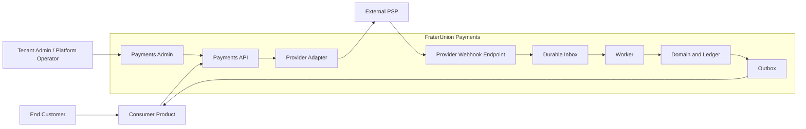

# FraterUnion Payments — System Context

## Status

Authoritative. Describes the intended system context and deployment model
for FraterUnion Payments. The monorepo currently implements tenancy,
authentication, immutable tenant audit logging, the outbox/inbox
substrate, the provider-neutral payment domain
(`@fraterunion-payments/payment-core`), provider contracts
(`@fraterunion-payments/provider-contracts`), canonical customers
with provider mappings, persisted canonical payments, and persisted
canonical refunds without provider execution (see the root
[`README.md`](../../README.md)); this document still defines the broader
target shape later commits build toward.

Last updated: 2026-09-02

## Actors and systems

- **FraterUnion platform operator** — the team operating FraterUnion
  Payments itself, with cross-tenant administrative capability.
- **Tenant administrators** — administrators within a single FraterUnion
  product/organization (for example, a GymOS operator), scoped to their
  own tenant.
- **Consumer products** — FraterUnion products (GymOS, RestaurantOS,
  PlazaOS, WristOS, UMA Temple of Beauty, SugarOS, and future products)
  that integrate against the FraterUnion Payments API/SDK to take
  payments on behalf of their own end customers.
- **End customers** — the people paying a consumer product. They interact
  with the consumer product's UI and, for card entry, with
  provider-controlled UI components — never directly with FraterUnion
  Payments.
- **FraterUnion Payments Admin** — the internal Next.js application for
  operating and inspecting the platform (payments, webhooks,
  reconciliation, provider connections).
- **FraterUnion Payments API** — the NestJS application exposing the
  versioned REST API consumer products and the Admin app use.
- **Worker** — the standalone Node.js process that polls the
  transactional outbox in PostgreSQL, claims work with
  `FOR UPDATE SKIP LOCKED`, and dispatches registered handlers. Future
  commits will add inbox-driven webhook processing and billing
  scheduling.
- **PostgreSQL** — the system of record for domain and ledger data, and
  the durable store for the transactional outbox and inbox (ADR-007).
- **Redis or future queue infrastructure** — not used for outbox/inbox
  delivery; reserved for later lock or cache needs if operational load
  requires it.
- **External payment providers** — Stripe initially; additional providers
  are a future, evaluated decision (see
  [`../product/vision.md`](../product/vision.md)).
- **Email/notification provider** — used for operational and
  dunning-related notifications; not yet selected or implemented.
- **Observability platform** — destination for structured logs, metrics,
  and traces; not yet selected or implemented.

## Mermaid context diagram

Two flows are represented:

- The **synchronous request path**: End Customer → Consumer Product →
  Payments API → Provider Adapter → External PSP, which returns an initial
  response (for example, "requires action" or "processing").
- The **asynchronous confirmation path**: External PSP → Provider Webhook
  Endpoint → Durable Inbox → Worker → Domain and Ledger → Outbox → Consumer
  Product, which is what actually finalizes payment state (see
  [`payment-lifecycle.md`](./payment-lifecycle.md)).

Admin and operational access is represented separately: tenant
administrators and the platform operator reach the system exclusively
through the Payments Admin application, which itself calls the Payments
API rather than accessing domain data directly.

## Trust boundaries

- **Public client boundary** — between end customers' browsers/devices and
  everything else. Nothing on the FraterUnion side of this boundary may
  receive raw card data; card entry happens inside provider-controlled UI
  components (see
  [`security-boundaries.md`](./security-boundaries.md)).
- **Consumer-server boundary** — between a consumer product's backend and
  the FraterUnion Payments API. Consumer products authenticate with API
  keys scoped to their organization; this boundary is where tenant
  identity is established for API requests.
- **FraterUnion internal boundary** — between the Payments API, the
  worker, and the database/queue. Internal services are trusted to talk to
  each other but must still carry and validate tenant context; internal
  trust is not a substitute for tenant isolation.
- **Provider boundary** — between FraterUnion Payments and each external
  payment provider. Provider adapters are the only components allowed to
  call provider APIs or receive provider webhooks.
- **Data-store boundary** — between application code and PostgreSQL/Redis.
  Only the API and worker processes hold data-store credentials; the
  Admin app and consumer products never connect to the data store
  directly.
- **Operational administrator boundary** — between the FraterUnion
  platform operator (cross-tenant) and tenant administrators
  (single-tenant). Both go through the Admin app and RBAC, but with
  different authorization scopes.

## Deployment model

The following is the intended initial deployment target. It is a plan, not
a description of what is currently deployed:

- Admin and Docs may run on Vercel.
- API and Worker may run on Railway.
- PostgreSQL may run on Neon or an equivalent managed Postgres provider.
- Redis may run as a managed service.

This model favors fast iteration on managed platforms over self-managed
infrastructure while the platform's operational requirements are still
being learned. It is expected to evolve as real traffic, compliance, and
reliability requirements become clear.

## Architectural style

- **Modular monolith initially.** The API is a single NestJS application
  internally organized into clear module boundaries (customers, payments,
  ledger, webhooks, and so on), rather than a distributed set of services.
- **Worker separated for asynchronous reliability.** Webhook processing
  and (later) billing scheduling run in a dedicated worker process so that
  slow or bursty asynchronous work never competes with, or is coupled to,
  the API's request/response path.
- **Internal package boundaries.** Domain logic
  (`@fraterunion-payments/payment-core`), provider contracts
  (`@fraterunion-payments/provider-contracts`), and shared utilities are
  separated into packages with explicit public exports, so that boundaries
  are enforced by package structure even inside the monolith.
- **No premature microservices.** Splitting the API or worker into
  multiple deployable services is not planned for v1. A modular monolith
  is easier to operate correctly at this stage and does not preclude
  future extraction.
- **Provider adapters isolated behind contracts.** All provider-specific
  code lives behind the interfaces defined in
  `@fraterunion-payments/provider-contracts`. Domain and ledger code never
  import a provider SDK directly.
- **Future extraction only when operational evidence justifies it.**
  Services are only split out of the monolith (for example, extracting the
  worker into its own scaled deployment, or splitting a module into a
  separate service) when real operational data — load, deployment
  cadence, team ownership — demonstrates the need, not speculatively.

## Related decisions

- [ADR-001](../decisions/ADR-001-nestjs-nextjs-and-typescript.md) —
  framework and language choices behind the API, Admin, Docs, and Worker
  described above.
- [ADR-003](../decisions/ADR-003-multi-tenant-organization-model.md) —
  the tenancy model underlying the FraterUnion internal boundary.
- [ADR-007](../decisions/ADR-007-transactional-outbox-and-inbox.md) — the
  inbox/outbox mechanism behind the asynchronous confirmation path shown
  in the context diagram.
